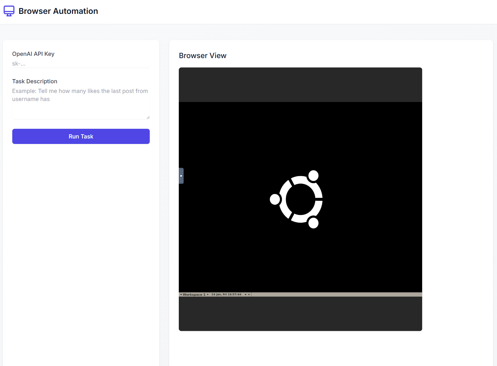

# Open Operator

A web-based tool that automates browser tasks using AI. 
Watch the automation happen in real-time while controlling it through a modern web interface.

## Demo




## Features
- Real-time browser automation visualization
- Clean web interface for task control
- OpenAI GPT-4o powered automation
- Support for both local and containerized deployment

## Running Directly

### Prerequisites
- Python 3.11 or higher
- Poetry package manager
- OpenAI API key

### Steps

1. Clone the repository:
```bash
git clone <repository-url>
cd browser-automation
```

2. Install Poetry if you haven't already:
```bash
curl -sSL https://install.python-poetry.org | python3 -
```

3. Install dependencies:
```bash
poetry install
```

4. Install Playwright browser:
```bash
poetry run playwright install chromium
```

5. Start the application:
```bash
poetry run python api.py
```

6. Open http://localhost:8000 in your browser

The browser automation will appear directly on your system when you run a task.

## Running with Docker

### Prerequisites
- Docker installed on your system
- OpenAI API key

### Steps

1. Build the Docker image:
```bash
docker build -t browser-automation .
```

2. Run the container:
```bash
docker run -p 8000:8000 -p 6080:6080 browser-automation
```

3. Access the application:
- Open http://localhost:8000 in your browser
- The browser automation will be visible in the embedded VNC viewer

## Usage

1. Enter your OpenAI API key in the web interface
2. Type your automation task (e.g., "Search for the cheapest guitar on amazon")
3. Click "Run Task"
4. Watch the automation happen in real-time
5. View the results in the interface

## Notes
- When running locally, Playwright opens on your system
- When using Docker, automation is visible through the embedded VNC viewer
- Default VNC password is "password"
- The application uses ports 8000 (web interface) and 6080 (VNC when using Docker)

## Troubleshooting
- If the VNC viewer shows a black screen, try refreshing the page
- If tasks fail, check your OpenAI API key and task description
- For Docker issues, ensure both ports (8000 and 6080) are available